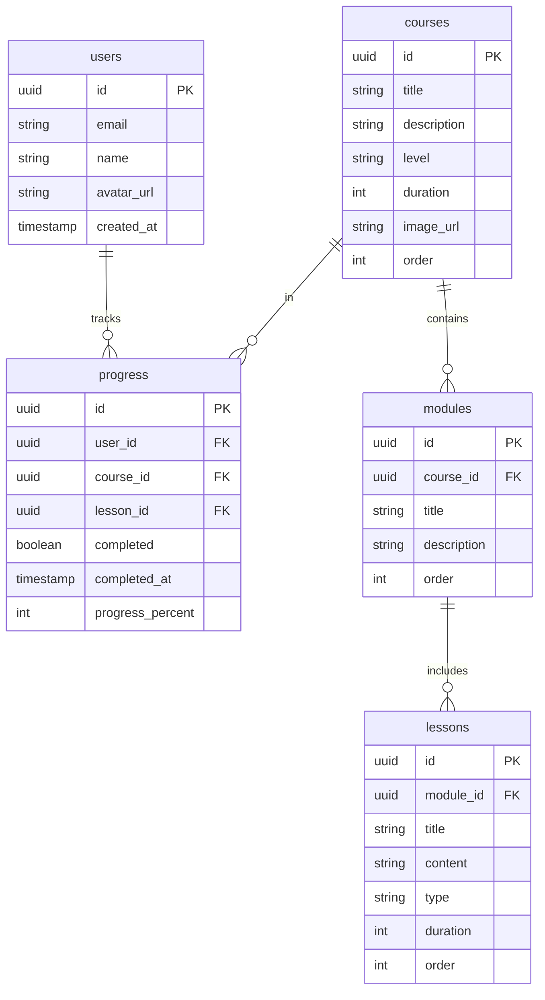

## 1. Architecture Design
```mermaid
graph TB
    Frontend[React Frontend] --&gt; Supabase[Supabase Backend]
    Supabase --&gt; Auth[Authentication]
    Supabase --&gt; DB[PostgreSQL Database]
    Supabase --&gt; Storage[Storage]
```

## 2. Technology Description
- Frontend: React@18 + TypeScript + tailwindcss@3 + vite
- Initialization Tool: vite-init
- Backend: Supabase
- Database: Supabase (PostgreSQL)
- State Management: zustand

## 3. Route Definitions
| Route | Purpose |
|-------|---------|
| / | 首页 |
| /courses | 课程列表 |
| /courses/:id | 课程详情 |
| /path | 学习路径 |
| /login | 登录页面 |
| /register | 注册页面 |
| /profile | 个人中心 |

## 4. Data Model

### 4.1 Data Model Definition


### 4.2 Data Definition Language
```sql
-- 用户表
CREATE TABLE users (
    id UUID PRIMARY KEY DEFAULT gen_random_uuid(),
    email TEXT UNIQUE NOT NULL,
    name TEXT,
    avatar_url TEXT,
    created_at TIMESTAMP DEFAULT NOW()
);

-- 课程表
CREATE TABLE courses (
    id UUID PRIMARY KEY DEFAULT gen_random_uuid(),
    title TEXT NOT NULL,
    description TEXT,
    level TEXT NOT NULL,
    duration INT,
    image_url TEXT,
    order_index INT DEFAULT 0
);

-- 模块表
CREATE TABLE modules (
    id UUID PRIMARY KEY DEFAULT gen_random_uuid(),
    course_id UUID NOT NULL,
    title TEXT NOT NULL,
    description TEXT,
    order_index INT DEFAULT 0
);

-- 课时表
CREATE TABLE lessons (
    id UUID PRIMARY KEY DEFAULT gen_random_uuid(),
    module_id UUID NOT NULL,
    title TEXT NOT NULL,
    content TEXT,
    type TEXT DEFAULT 'video',
    duration INT,
    order_index INT DEFAULT 0
);

-- 学习进度表
CREATE TABLE progress (
    id UUID PRIMARY KEY DEFAULT gen_random_uuid(),
    user_id UUID NOT NULL,
    course_id UUID,
    lesson_id UUID,
    completed BOOLEAN DEFAULT false,
    completed_at TIMESTAMP,
    progress_percent INT DEFAULT 0,
    created_at TIMESTAMP DEFAULT NOW()
);

-- 启用 RLS
ALTER TABLE users ENABLE ROW LEVEL SECURITY;
ALTER TABLE courses ENABLE ROW LEVEL SECURITY;
ALTER TABLE modules ENABLE ROW LEVEL SECURITY;
ALTER TABLE lessons ENABLE ROW LEVEL SECURITY;
ALTER TABLE progress ENABLE ROW LEVEL SECURITY;

-- 设置权限
GRANT SELECT ON courses TO anon;
GRANT SELECT ON modules TO anon;
GRANT SELECT ON lessons TO anon;
GRANT ALL PRIVILEGES ON users TO authenticated;
GRANT ALL PRIVILEGES ON progress TO authenticated;
```
